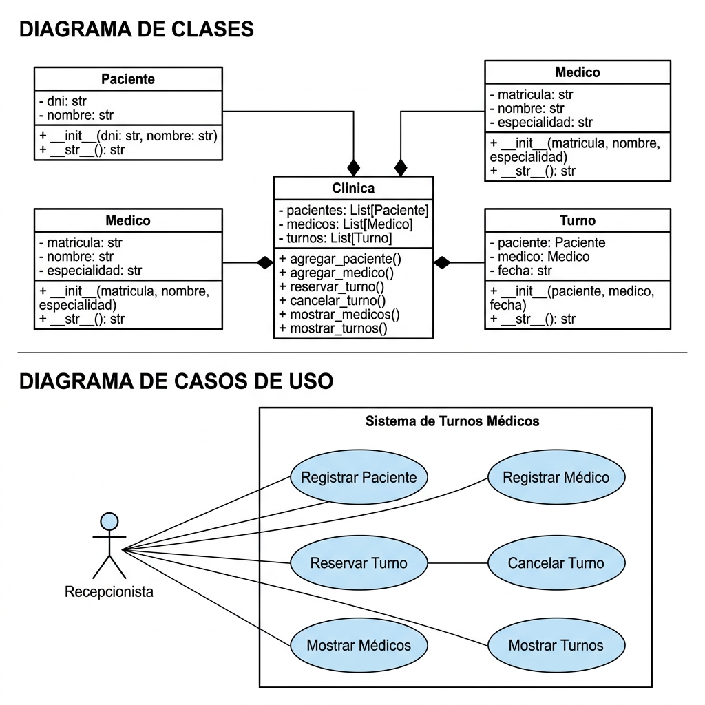

# 1. Presentación del Software

## Nombre del Software

**Sistema de Gestión de Turnos Médicos**

## Descripción General

El sistema permite administrar turnos médicos mediante consola. Está desarrollado utilizando Programación Orientada a Objetos en Python.

El software permite:

- Registrar pacientes.
- Registrar médicos.
- Reservar turnos.
- Cancelar turnos.
- Consultar turnos registrados.
- Consultar médicos disponibles.

El objetivo principal es automatizar la administración básica de turnos médicos.

## 1.1 Descriptivo del Software

### Objetivo del Software

Desarrollar un sistema orientado a objetos que permita gestionar turnos médicos de manera simple y eficiente.

El sistema busca:

- Organizar información de pacientes y médicos.
- Registrar turnos.
- Cancelar turnos.
- Facilitar consultas rápidas.

### Requerimientos Funcionales

**RF01 – Registrar paciente**
El sistema debe permitir registrar pacientes indicando DNI y Nombre.

**RF02 – Registrar médico**
El sistema debe permitir registrar médicos indicando Matrícula, Nombre y Especialidad.

**RF03 – Reservar turno**
El sistema debe permitir reservar un turno entre un paciente y un médico, validando su existencia.

**RF04 – Cancelar turno**
El sistema debe permitir cancelar un turno previamente registrado.

**RF05 – Mostrar médicos**
El sistema debe listar todos los médicos registrados.

**RF06 – Mostrar turnos**
El sistema debe mostrar todos los turnos registrados.

### Requerimientos No Funcionales

**RNF01 – Usabilidad**
El sistema debe poseer un menú simple y fácil de utilizar.

**RNF02 – Rendimiento**
Las operaciones deben ejecutarse en menos de 2 segundos.

**RNF03 – Mantenibilidad**
El código debe estar organizado en clases y métodos reutilizables.

**RNF04 – Compatibilidad**
El software debe ejecutarse en Python 3.10 o superior.

## Estructura del Proyecto

```
tpfinal/
├── clinica.py                   # Módulo principal (clases Paciente, Medico, Turno, Clinica)
├── main.py                      # Interfaz de consola (menú interactivo)
├── test_PruebaComponentes.py    # Pruebas de componentes
├── test_IntegracionPrueba.py    # Pruebas de integración
├── test_CajaNegra.py            # Pruebas de caja negra
├── test_PruebaDeRendimiento.py  # Pruebas de rendimiento
├── test_PruebaInterfaz.py       # Pruebas de interfaz
├── test_PruebaCamino.py         # Pruebas de camino
├── test_E2E.py                  # Pruebas End-to-End
├── PlanDePruebas.md             # Plan de pruebas
├── DocumentacionEjecucion.md    # Documentación de ejecución
├── resultado_tests.log          # Log de ejecución de pruebas
├── ejecutar.sh / ejecutar.bat   # Scripts de ejecución
├── ejecutar_pruebas.sh / .bat   # Scripts de ejecución de pruebas
└── Readme.md                    # Este archivo
```

## Ejecución

```bash
# Windows
ejecutar.bat

# Linux/Mac
bash ejecutar.sh
```

## Ejecución de Pruebas

```bash
# Windows
ejecutar_pruebas.bat

# Linux/Mac
bash ejecutar_pruebas.sh
```

## Resultados de Pruebas (Testing)

El sistema ha sido sometido a un conjunto completo de pruebas automatizadas cubriendo distintos niveles de testing, con una tasa de aprobación del **100% (19/19 tests pasados)**.

- **Pruebas de Componentes (3 tests):** Validaron la creación individual de clases (`Paciente`, `Medico`, `Clinica`).
- **Prueba de Integración (1 test):** Comprobó el flujo integral uniendo módulos (registrar paciente/médico y reservar turno).
- **Pruebas de Caja Negra (7 tests):** Evaluaron las entradas y salidas del sistema (DNI duplicados, médicos inexistentes, cancelaciones válidas e inválidas).
- **Prueba de Rendimiento (1 test):** Verificó la escalabilidad registrando 1000 pacientes en menos de 1 segundo.
- **Pruebas de Interfaz (2 tests):** Validaron el formato de salida correcto hacia el usuario en la consola.
- **Pruebas de Camino (3 tests):** Evaluaron todas las bifurcaciones lógicas (`if/else`) del método principal de reserva de turnos.
- **Pruebas End-to-End (2 tests):** Simularon el uso real del sistema a través del menú de consola interactivo (happy path y manejo de errores).

Para más detalles, consultar el documento `PlanDePruebas.md` y `DocumentacionEjecucion.md`.

# Diagrama UML


